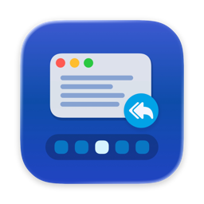
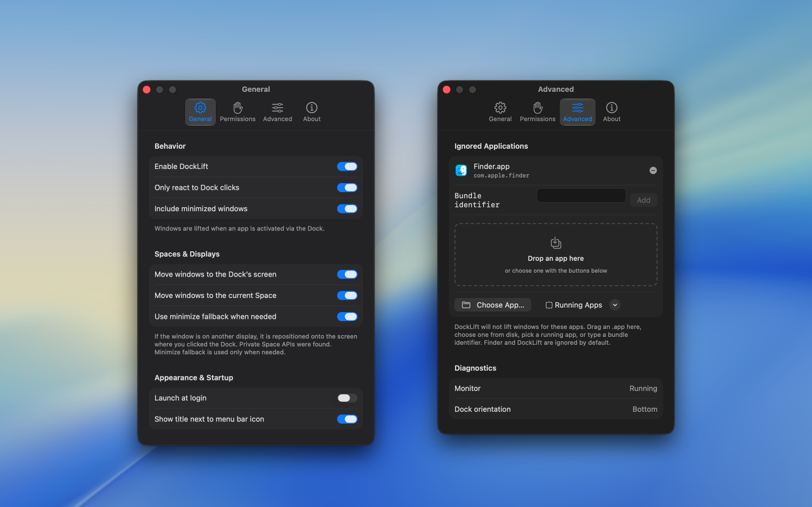

   
   
  
  <h1>
    DockLift
  </h1>
  <!--rehype:style=border: 0;-->
  

    <a href="./README.md">English</a> • 
    <a target="_blank" href="https://github.com/jaywcjlove/docklift/issues/new?template=bug_report_cn.yml">联系&支持</a> • 
    <a href="./docs/CHANGELOG.zh.md">更新日志</a>
  

  

    
  

用 Mac 接了外接显示器时，你在当前屏幕的 Dock 里点了应用，窗口却可能还在另一块屏上——应用明明开着，却不在眼前。

**DockLift** 在菜单栏运行：点击 Dock 图标时，把该应用最近使用的窗口移到**你正在用的这块屏幕**并前置显示，不用再扭头找另一块显示器。

### 功能亮点

- 把窗口带到你点击 Dock 的那块屏幕
- 应用已在其它屏幕打开时同样有效
- 可找回最小化窗口
- 菜单栏一键开关
- 可忽略不想处理的应用

### 怎么用

1. 打开 DockLift，菜单栏会出现图标。
2. 系统询问时，允许辅助功能权限（用于移动窗口）。
3. 保持 DockLift 开启。
4. 在 Dock 点击应用 — 若窗口在其它屏幕，应出现在你当前使用的屏幕上。

<!--idoc:config:
title: DockLift
keywords: 窗口,Dock,多显示器,显示器,多屏,屏幕,窗口管理,窗口切换,桌面,效率,菜单栏,外接显示器
description: DockLift 在菜单栏运行：点击 Dock 图标时，把该应用最近使用的窗口移到**你正在用的这块屏幕**并前置显示，不用再扭头找另一块显示器。
-->
